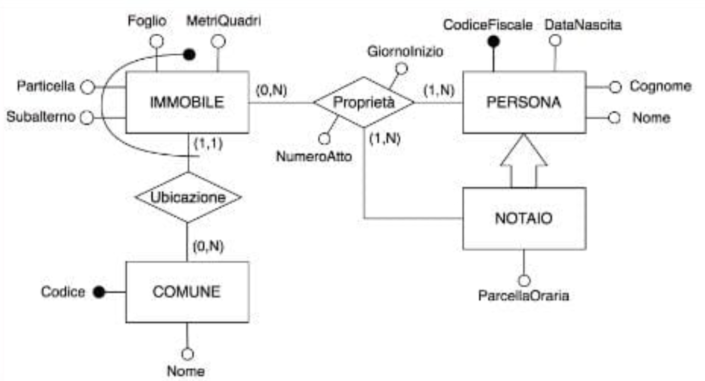
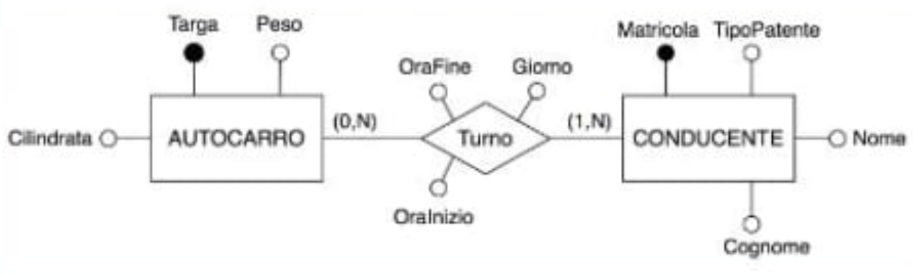
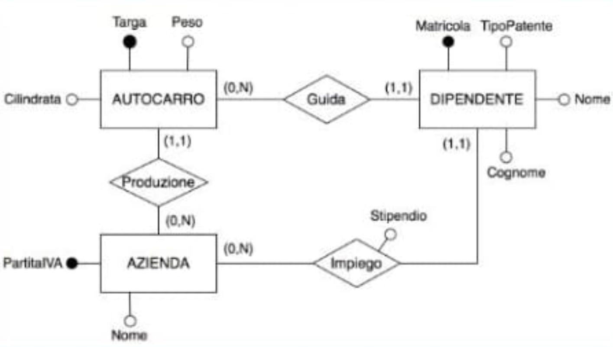
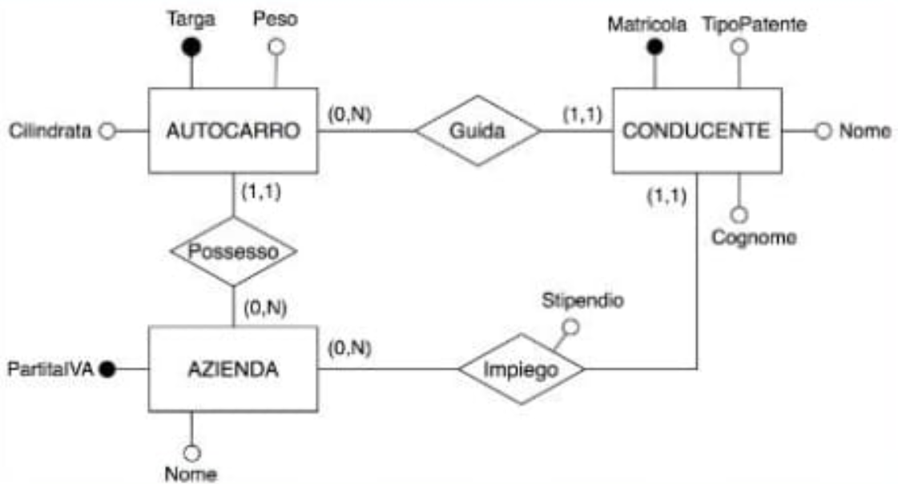

# Domanda 1

> Sia dato lo schema relazionale:
> MOBILE (<u>Codice</u>, Modello, Costo)
> CLIENTE (<u>CF</u>, Nome, Cognome, Città)
> ORDINE (<u>CFCliente, CodiceMobile</u>, Data, Trasporto)
> con vincoli di integrità referenziale tra CFCliente di ORDINE e CLIENTE e CodiceMobile di ORDINE e MOBILE.
> Cosa determina l'interrogazione seguente?
> $$\pi_{\text{Codice, Modello}}(\pi_{\text{Codice, Modello, Costo}} (\text{MOBILE})) - \pi_{\text{Codice, Modello}} (\text{MOBILE} \bowtie_{\text{Modello}=\text{Modello1 AND Costo}<\text{Costo1}} (\rho_{\text{X1}\leftarrow\text{X}}(\text{MOBILE})))$$

1. Per ogni modello, il codice del mobile più costoso.
2. Nessuna delle altre alternative è corretta.
3. Per ogni modello, il codice del mobile meno costoso.
4. Il codice e il modello di tutti i mobili.

Risposta corretta
1

# Domanda 2

> In un comune avente codice identificativo e nome, un immobile è identificato dal codice del comune, e da foglio, particella, e subalterno. Un immobile è ubicato in un comune, e diviene di proprietà di una o più persone a partire da un dato giorno, a seguito della stipula di un atto numerato che comprende tutti i proprietari, redatto da un notaio avente una parcella oraria. Nel tempo, gli immobili possono cambiare uno o più proprietari, senza alcun vincolo. Un immobile può non avere proprietari. Il diagramma E-R in figura rappresenta la realtà sopra descritta?

1. sì, ma solo dopo essere stato ristrutturato perché contiene una generalizzazione (sottoinsieme)
2. sì, indipendentemente dalla presenza della generalizzazione (sottoinsieme)
3. no
4. nessuna delle altre alternative è corretta

Risposta corretta
3

# Domanda 3

> Sia dato lo schema relazionale:
> PERSONA (<u>CF</u>, Nome, Cognome, Affiliazione)
> CONFERENZA (<u>Nome, Anno</u>, Città)
> ISCRIZIONE (<u>NomeConf, AnnoConf, CF</u>, Data, Importo)
> con vincoli di integrità referenziale tra NomeConf, AnnoConf di ISCRIZIONE e CONFERENZA, e CF di ISCRIZIONE e PERSONA.
> Quale delle seguenti espressioni rappresenta la relazione che determina le affiliazioni delle persone che si sono iscritte alla conferenza ECIR nel 2025?

1. $\pi_{\text{Affiliazione}} (\sigma_{\text{NomeConf}=\text{'ECIR' AND AnnoConf}=2025} (\text{ISCRIZIONE} \bowtie \text{PERSONA}))$
2. $\pi_{\text{Affiliazione}} (\sigma_{\text{NomeConf}=\text{'ECIR' AND AnnoConf}=2025} (\text{PERSONA} \bowtie \text{CONFERENZA}))$
3. $\pi_{\text{Affiliazione}} (\sigma_{\text{NomeConf}=\text{'ECIR' AND AnnoConf}=2025} (\text{ISCRIZIONE} \times \text{PERSONA}))$
4. Nessuna delle altre alternative è corretta.

Risposta corretta
1

# Domanda 4

> La traduzione del diagramma E-R in figura verso il modello logico relazionale è:

1. AUTOCARRO (<u>Targa</u>, Cilindrata, Peso)
   CONDUCENTE (<u>Matricola</u>, Cognome, Nome, TipoPatente)
   TURNO (<u>Conducente, Autocarro, Giorno</u>, OraInizio, OraFine)
   soggetto ai seguenti vincoli di integrità referenziale:
   - TURNO(Conducente) references CONDUCENTE(Matricola)
   - TURNO(Autocarro) references AUTOCARRO(Targa)
2. AUTOCARRO (<u>Targa</u>, Cilindrata, Peso)
   CONDUCENTE (<u>Matricola</u>, Cognome, Nome, TipoPatente)
   TURNO (<u>Conducente, Autocarro, Giorno</u>, OraInizio, OraFine)
   soggetto ai seguenti vincoli di integrità referenziale:
   - TURNO(Conducente) references CONDUCENTE(Matricola)
   - TURNO(Autocarro) references AUTOCARRO(Targa)
3. AUTOCARRO (<u>Targa</u>, Cilindrata, Peso)
   CONDUCENTE (<u>Matricola</u>, Cognome, Nome, TipoPatente, Autocarro, Giorno, OraInizio, OraFine)
   soggetto al seguente vincolo di integrità referenziale:
   - CONDUCENTE(Autocarro) references AUTOCARRO(Targa)
4. nessuna delle altre alternative è corretta

Risposta corretta
1

# Domanda 5

> Considerato il diagramma E-R in figura, si può affermare che:

1. il diagramma E-R non presenta ridondanza
2. il diagramma E-R presenta ridondanza dovuta alla presenza del ciclo
3. non è possibile stabilire se il diagramma E-R contenga ridondanza
4. nessuna delle altre alternative è corretta

Risposta corretta
1

# Domanda 6

> Un attributo multivalore di un'entità E è:

1. può assumere più di un valore, ma sempre lo stesso numero di valori per ogni occorrenza di E
2. è formato da più attributi che presentano affinità nel loro significato o uso
3. può assumere più di un valore, ma non necessariamente lo stesso numero di valori per ogni occorrenza di E
4. nessuna delle altre alternative è corretta

Risposta corretta
3

# Domanda 7

> Date le relazioni $R(\underline{A}, B)$ con cardinalità $|R|$, e $S(\underline{A})$ con cardinalità $|S|$, quali sono le cardinalità minima e massima dell'espressione $R \bowtie S$?

1. Cardinalità minima: 0, cardinalità massima: $|S|$
2. Nessuna delle altre alternative è corretta
3. Cardinalità minima: 0, cardinalità massima: $|R|$
4. Cardinalità minima: $\min(|R|, |S|)$, cardinalità massima: $\max(|R|, |S|)$

Risposta corretta
2

# Domanda 8

> Supponiamo di avere una relazione ORDINI(Clienti, Prodotto, Quantità) con chiave primaria (Clienti, Prodotto). Quale delle seguenti affermazioni è corretta?

1. Un cliente può ordinare un determinato prodotto solo una volta, in una quantità qualsiasi.
2. Lo stesso prodotto non può essere ordinato da clienti diversi.
3. Un cliente può ordinare lo stesso prodotto con più quantità diverse.
4. Nessuna delle altre affermazioni è corretta.

Risposta corretta
1

# Domanda 9

> Quale delle seguenti affermazioni sul calcolo dei domini è vera?

1. Il calcolo dei domini è un linguaggio dichiarativo.
2. Il calcolo dei domini è semanticamente equivalente all'algebra relazionale.
3. Nessuna delle altre affermazioni è vera.
4. Il calcolo dei domini è un linguaggio procedurale.

Risposta corretta
1

# Domanda 10

> Quale delle seguenti affermazioni sulla persistenza dei dati in un DBMS è vera?

1. Nessuna delle altre affermazioni è vera.
2. I dati sono persi quando il software DBMS è chiuso.
3. I dati sono immagazzinati anche dopo lo spegnimento del calcolatore.
4. I dati sono persi solo dopo lo spegnimento del calcolatore.

Risposta corretta
3

# Domanda 11

> Sia dato lo schema relazionale:
> PERSONA (<u>CF</u>, Nome, Cognome, Affiliazione)
> CONFERENZA (<u>Nome, Anno</u>, Città)
> ISCRIZIONE (<u>NomeConf, AnnoConf, CF</u>, Data, Importo)
> con vincoli di integrità referenziale tra NomeConf, AnnoConf di ISCRIZIONE e CONFERENZA, e CF di ISCRIZIONE e PERSONA.
> Quale delle seguenti espressioni rappresenta la relazione che determina il nome e il cognome delle persone che si sono iscritte ad almeno due conferenze aventi nomi diversi?

1. Nessuna delle altre alternative è corretta.
2. $\pi_{\text{Nome, Cognome}} (\sigma_{\text{CF1}=\text{CF AND NomeConf1}\neq\text{NomeConf}} (\rho_{\text{X1}}(\text{ISCRIZIONE} \bowtie \text{CONFERENZA}) \times (\text{ISCRIZIONE} \bowtie \text{CONFERENZA})))$
3. $\pi_{\text{Nome1, Cognome1}} (\sigma_{\text{CF1}=\text{CF AND NomeConf1}\neq\text{NomeConf}} (\rho_{\text{X1}}(\text{ISCRIZIONE} \bowtie \text{PERSONA}) \times (\text{ISCRIZIONE} \bowtie \text{PERSONA})))$
4. $\pi_{\text{Nome, Cognome}} (\sigma_{\text{CF1}=\text{CF AND NomeConf1}\neq\text{NomeConf}} (\rho_{\text{X1}}(\text{ISCRIZIONE} \bowtie \text{PERSONA}) \times (\text{ISCRIZIONE} \bowtie \text{PERSONA})))$

Risposta corretta
4

# Domanda 12

> Si consideri il seguente schema di base di dati:
> INGREDIENTE (<u>CodIngr</u>, Nome)
> RICETTA (<u>NomeRicetta</u>, Nazionalità)
> PROCEDIMENTO (<u>NomeRicetta, CodIngr</u>)
> Indicare quale delle seguenti espressioni del calcolo dei domini rappresenta l'espressione algebrica:
> $$\pi_{\text{NomeRicetta}}(\text{RICETTA}) - \pi_{\text{NomeRicetta}}(\sigma_{\text{Nazionalità}=\text{'Italiana'}}(\text{INGREDIENTE} \bowtie \text{PROCEDIMENTO} \bowtie \text{RICETTA}))$$

1. L'espressione algebrica indicata non può essere espressa nel calcolo relazionale dei domini.
2. $\{ \text{NomeRicetta: } nr \mid \text{RICETTA(NomeRicetta: } nr, \text{ Nazionalità: } n) \land \text{PROCEDIMENTO(NomeRicetta: } nr, \text{ CodIngr: } ci) \land n = \text{'Italiana'} \}$
3. Nessuna delle altre alternative è corretta.
4. $\{ \text{NomeRicetta: } nr \mid \text{RICETTA(NomeRicetta: } nr, \text{ Nazionalità: } n) \land \neg(\exists ci, i (\text{PROCEDIMENTO(NomeRicetta: } nr, \text{ CodIngr: } ci) \land \text{INGREDIENTE(CodIngr: } ci, \text{ Nome: } i) \land n = \text{'Italiana'})) \}$

Risposta corretta
3

# Domanda 13

> Data la relazione $R(A,B)$, quale delle seguenti espressioni è equivalente all'espressione $R \cup (\sigma_{c}(R))$ dove c è una condizione?

1. $(\sigma_{\text{NOT } c}(R)) \bowtie R$
2. $R$
3. Nessuna delle altre espressioni è equivalente all'espressione data
4. $(\sigma_{c}(R))$

Risposta corretta
4

# Domanda 14

> Dato il seguente schema logico di base di dati:
> $E_1(\underline{kg_1}, a, b)$
> $E_2(\underline{kg_2}, c, d)$
> $R(\underline{ka_1, ka_2})$
> quale delle seguenti affermazioni è falsa?

1. può essere la traduzione di uno schema E-R con due entità ($E_1$ ed $E_2$) connesse da una relazione R di tipo uno-a-molti o molti-a-uno
2. può essere la traduzione di uno schema E-R con due entità ($E_1$ ed $E_2$) connesse da una relazione R di tipo uno-a-uno
3. tutte le altre alternative sono false
4. non può essere la traduzione di uno schema E-R con due entità ($E_1$ ed $E_2$) connesse da una relazione R di tipo molti-a-molti

Risposta corretta
3

# Domanda 15

|

> La traduzione del diagramma E-R in figura verso il modello logico relazionale:

1. genera 4 tabelle e 4 vincoli di integrità referenziale
2. genera 3 tabelle e 3 vincoli di integrità referenziale
3. genera 3 tabelle e 2 vincoli di integrità referenziale
4. nessuna delle altre alternative è corretta

Risposta corretta
2

# Domanda 16

> Un vincolo di integrità referenziale:

1. garantisce che ogni attributo abbia un valore diverso all'interno della tabella
2. nessuna alternativa è corretta
3. impedisce che una tabella contenga colonne duplicate
4. assicura che ogni riga abbia un identificatore univoco all'interno della tabella

Risposta corretta
2

# Domanda 17

> Sia dato lo schema relazionale:
> MOBILE (<u>Codice</u>, Modello, Costo)
> CLIENTE (<u>CF</u>, Nome, Cognome, Città)
> ORDINE (<u>CFCliente, CodiceMobile, Data</u>, Trasporto)
> con vincoli di integrità referenziale tra CFCliente di ORDINE e CLIENTE e CodiceMobile di ORDINE e MOBILE.
> Cosa determina l'interrogazione seguente?
> $$\pi_{\text{CFCliente}}(\text{ORDINE}) - \pi_{\text{CFCliente}}(\sigma_{\text{Trasporto} = \text{'a carico del cliente'}}(\text{ORDINE}))$$

1. Nessuna delle altre alternative è corretta.
2. Il codice fiscale dei clienti che hanno effettuato solo ordini con modalità di trasporto a carico del cliente.
3. Il codice fiscale dei clienti che hanno effettuato almeno un ordine con modalità di trasporto a carico del cliente.
4. Il codice fiscale dei clienti che non hanno effettuato ordini con modalità di trasporto a carico del cliente.

Risposta corretta
2

# Domanda 18

> Quando si traduce una relazione molti-a-molti fra due entità $E_1$ ed $E_2$ verso il modello logico relazionale, gli eventuali attributi della relazione:

1. devono essere inglobati nello schema delle due tabelle rispettivamente generate dalla traduzione di $E_1$ ed $E_2$
2. possono essere inglobati nello schema della tabella generata dalla traduzione di $E_1$ oppure in quello di $E_2$
3. nessuna delle altre alternative è corretta
4. non possono mai essere inglobati né nello schema della tabella generata dalla traduzione di $E_1$, né in quello di $E_2$

Risposta corretta
4

# Domanda 19

> Assumendo che le parentesi tonde indichino una tupla, quale delle seguenti istanze di relazione sicuramente non rispetta il modello relazionale?

1. Tutte le altre risposte rispettano il modello relazionale.
2. $\{ (a, 1), (b, 2, 2), (c, 3) \}$
3. $\{ (a, 1), (b, 2), (c, 3) \}$
4. $\{ (a, 1, \text{'abc'}) \}$

Risposta corretta
2

# Domanda 20

> Nel modello relazionale, quale delle seguenti affermazioni sul valore NULL è vera?

1. Nessuna delle altre affermazioni è vera.
2. NULL può essere presente in un attributo di una chiave primaria.
3. NULL rappresenta l'assenza di un valore.
4. NULL è equivalente a 0.

Risposta corretta
3
