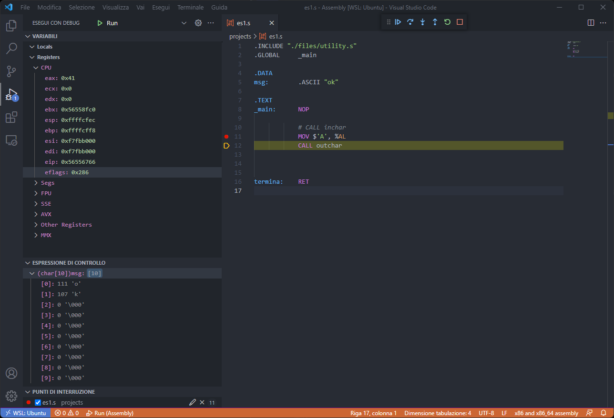

# Visual Studio Code Assembler Setup (**WINDOWS/LINUX**)

Semplice guida per programmare/debuggare facilmente del codice Assembler su Visual Studio Code.

Su Windows viene fatto uso di [WSL](https://docs.microsoft.com/it-it/windows/wsl/) (Sottosistema di Windows per Linux) e ovviamente di [Visual Studio Code](https://code.visualstudio.com/)

Alla fine di questa guida potrete fare questo:



## Guida per **WINDOWS/LINUX**
> Per i possessori di un sistema operativo linux possono saltare direttamente al punto [x]().

1. ### Installazione di WSL
Aprire un Windows prompt dei comandi e immettere questo comando:
```cmd
wsl --install
```
_Una guida più dettagliata può essere trovata [qui](https://docs.microsoft.com/it-it/windows/wsl/install), ma per quello che ci serve basta solo questo._
