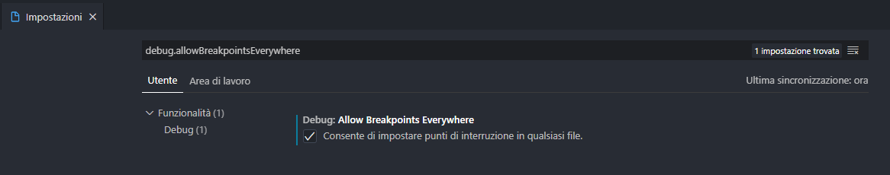
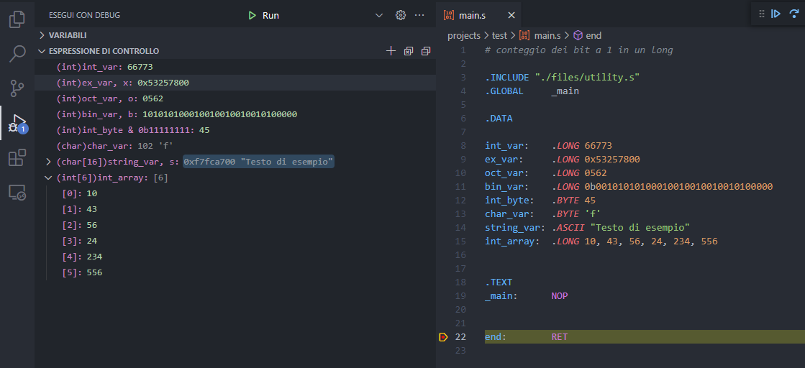

# Visual Studio Code Assembler Setup (**WINDOWS/LINUX**)

<div style="width:100%;">
	 
</div>

<br>
<br>

Semplice guida per programmare/debuggare facilmente del codice Assembler su Visual Studio Code.

**I file usati sono esattamente quelli forniti dai professori.**

Su Windows viene fatto uso di [WSL](https://docs.microsoft.com/it-it/windows/wsl/) (Sottosistema di Windows per Linux) e ovviamente di [Visual Studio Code](https://code.visualstudio.com/)

Alla fine di questa guida potrai fare questo:


## Guida per **WINDOWS/LINUX**
> Per i possessori di un sistema operativo linux possono saltare direttamente al punto [3](#3-setup-linux-environment).

### 1. Installazione di WSL
Aprire un Windows prompt dei comandi e immettere questo comando:
```cmd
wsl --install
```
_Una guida più dettagliata può essere trovata [qui](https://docs.microsoft.com/it-it/windows/wsl/install), ma per quello che ci serve basta solo questo._


### 2. Installazione e configurazione dell'estensione per il WSL

Per usare VS Code nel WSL è necessario installare l'estensione [Remote - WSL](https://marketplace.visualstudio.com/items?itemName=ms-vscode-remote.remote-wsl)

Per accedere al Subsystem Linux basta solo premere il pulsante blu con le doppie freccie in basso a sinistra. Dopodichè apparirà una lista di selezione, dovrai premere `New WSL Window`.

### 3. Setup Linux environment

Aprire un terminale **_bash_** su VS Code (`CTRL`+`ò`) e immetere i seguenti comandi:
```bash
sudo apt-get update
sudo apt-get install build-essential gdb gcc-multilib musl-dev
```

### 4. Installazione estensioni

È necessario installare l'estensione [C/C++](https://marketplace.visualstudio.com/items?itemName=ms-vscode.cpptools) se non l'avete già installata (su windows è importante che sia installata in wsl, è possibile farlo selezionando il pulsante `Installa in WSL`).

È consigliata anche l'installazione dell'estensione [ASM Code Lens](https://marketplace.visualstudio.com/items?itemName=maziac.asm-code-lens) utile il Syntax highlighting, per utilizzare i breakpoint e altre cose fighe.

### 5. Configurazione Workspace

Scaricare il file [setup.zip](./setup.zip), contiene l'assemblatore per i file assemler, la libreria per la manipolazione dell'I/O e la configurazione per vs code.

Decomprimere il file zip e copiare tutti i file (con la stessa struttura) in una cartella che preferisci (sarà la cartella dove poi programmerai i progetti in Assembler). La struttura dovrebbe essere simile a questa:
```
MyFolder				# Cartella che hai scelto
├── .vscode				# File di configurazione di VS Code
│   ├── launch.json			# Procedura per il debug
│   └── tasks.json			# Procedura per la compilazione del file assembler
├── files				# File messi a disposizione dai docenti
│   ├── main.c				# Assemblatore
│   └── utility.s			# Libreria I/O
└── projects				# Cartella per i progetti
    └── demo
	    └── es1.s			# File di esempio
```

Infine aprire la cartella `MyFolder` in VS Code, è importante aprire come directory principale `MyFolder` e non una sua sottodirectory altrimenti non funziona.
Un modo rapido è eseguire questi comandi:

```bash
cd /My/Folder/Location/MyFolder
code .
```

### 6. RUN MY SCRIPT!

Arrivati a questo punto è tutto pronto per programmare in assembler "comodamente".

- Per debuggare un file Assembly andare in alto "Esegui > Avvia debug".
- Per eseguire un file Assembly andare in alto "Esegui > Esegui senza eseguire il debug".
- Per compilare soltanto un file Assembly premere `CTRL`+`MAIUSC`+`B`.

## FAQ

- ### Non riesco ad aggiungere i breakpoints
Andare in impostazioni (`CTRL`+`,`) e abilitare `debug.allowBreakpointsEverywhere`.


- ### Non riesco a vedere i registri
Andare nella finestra di Debug (`CTRL`+`MAIUSC`+`D`), mettere un breakpoint e avviare il debug. Adesso è possibile vedere la schermate delle variabili, i registri si trovano in Variabili > Registers > CPU.


- ### Come faccio a vedere il valore di una variabile?
Le variabili vanno castate altrimenti il debugger non sà come trattarle.
Quindi se abbiamo un intero `(int)myvar`, un char `(char)myvar` e così via.

Per vedere il valore in esadecimale si aggiunge `, x` (ad esempio `(int)myvar, x`), per vederlo in ottale si aggiunge `, o` (`(int)myvar, o`) e in binario si aggiunge `, b` (`(int)myvar, b`).

Per visualizzare un vettore si aggiungono le parentesi quadre e ci si inserisce la dimensione (es. `(int[32])myvar`)

Per visualizzare una stringa utilizzare la notazione con le parentesi quadre e poi aggiungere `, s` (es. `(char[22])myvar, s`)

Per visualizzare una variabile salvata in una dimensione di 1 o 2 byte bisogna essere smart (hahahha), bisogna creare una maschera di bit e fare un AND bit a bit. Ad esempio se abbiamo una variabile salvata come BYTE allora dovremmo fare `(int)myvar & 0b11111111`.



Per ulteriori informazioni: https://docs.microsoft.com/en-us/visualstudio/debugger/format-specifiers-in-cpp?view=vs-2019

## Problemi Noti
- [ ] Quando si esegue un file Assembly, utilizzando il debugger gdb, il terminale viene sempre sporcato dalla scritta simile a questa `[1] + Done                       "/usr/bin/gdb" --interpreter=mi -silent --tty=${DbgTerm} 0<"/tmp/Microsoft-MIEngine-In-crdr2mef.vog" 1>"/tmp/Microsoft-MIEngine-Out-wpbplk44.rbh"`.
- [ ] Il problemMatcher di VS Code non riesce a individuare tutti gli errori/warning durante la fase di build del file Assembler (ci sto ancora lavorando).