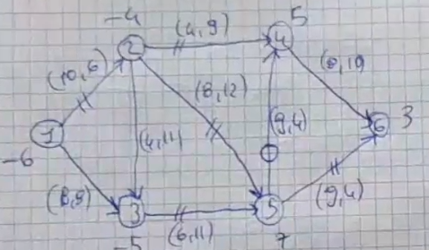
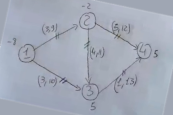

<script type="text/javascript"
        src="https://cdnjs.cloudflare.com/ajax/libs/mathjax/2.7.0/MathJax.js?config=TeX-AMS_CHTML">
</script>

# Ricerca Operativa - Orali Appello I 

## 2021-06-07

### Orale 1

#### PLI
- Cosa è un piano di taglio?
- Dato il seguente sistema, come risolveresti l'ottimo del rilassato continuo?
		$
		\left\{\begin{array}{l}
		\min 6 x+6 x_{2} \\
		13 x_{1}+11 x_{2} \geqslant 66 \\
		18 x_{1}+6 x_{2} \geqslant 43 \\
		x \geqslant 0 x \in \mathbb{Z}^{n}
		\end{array}\right.
		$

	- dove metteresti 66?
	- Metti che l'ottimo del RC è `(66/13, 0)` , trovami un piano di gomory.
  	  $
		\text{r1)} \quad \frac{11}{13} x_{1} + \frac{12}{13}  x_{2} \geqslant \frac{1}{13}  \\
	  $

#### PL su reti 
- Data una rete capacitata, trovare:
	
  - $ \text {Flusso:} \quad
		x=\left(\begin{array}{ccccccccc}
		12 & 13 & 23 & 24 & 25 & 35 & 46 & 54 & 56 \\
		6 & 0 & 0 & 1 & 9 & 5 & 0 & 4 & 3
		\end{array}\right)
  	$

  - $ 
		\text{Potenziale: } \quad \pi=(0,10,12,14,18,27)
	$

  - Arco entrante ed arco uscente (passo del simplesso) `k = (1, 3), h = (1, 2)`


#### PLN
$$
\begin{aligned}
f &=x_{1}+x_{2} \\
g_{1}=&-x_{1}^{2}+x_{2}^{2}-1 \leqslant 0 \\
g_{2}=& x_{r}^{2}+x_{2}^{2}-16 \leqslant 0
\end{aligned} \\
\text{Calcolare i moltiplicatori LKKT dato il punto } \quad x = (2\sqrt{2}, 2\sqrt{2})
$$

- supponi di avere 5 punti e di aver trovato i moltiplicatori discordi... ho sbagliato i conti, non sono solo questi i cinque punti ed ho sicuramente dimenticato qualche punto stazionario. Perchè? 
  ```Dominio chiuso, limitato e non vuoto perchè ho i punti. Perciò esiste sicuramente il massimo e il minimo globale di Weirstrass e non è possibile che max e min globali non esistano```

- Disegna un poliedro e numera i lati. (2, 5) potrebbe essere una base ammissibile per il primale? e per il duale?
- dato un problema di trovare il cammino minimo di 1000 nodi, come imposto il problema? E se avessi un costo sugli archi?

### Orale 2
#### PL
- cosa vuol dire che una soluzione di base primale è degenere? `Rispetta qualche vincolo non di base con l'uguale`
- soluzione di base duale degenere?
- Quante regole anticilo di bland ci sono per ogni simplesso? (2)
- Quali sono i criteri di stop del simplesso? (illimitato e test di ottimalità)
- Quale è il modello del problema di massima copertura?
- Come opera l'algoritmo di Chvatal? `Supponiamo di aver già ridotto la matrice, calcoliamo i rendimenti e prendiamo il ...`
- Fare un passo del simplesso di:
  $$
	\left\{\begin{array}{cc}
	\operatorname{max} & 5 x_{1}+6 x_{2} \\
	-3 x_{1}+x_{2} & \leqslant 3 \\
	-x_{2} & \leqslant 0 \\
	-x_{1} & +2 x_{2} \leqslant 6 \\
	x_{1} & +x_{2} \leqslant 6 \\
	x_{1} & \leqslant 4 \\
	-x_{1} & \leqslant 1
	\end{array}\right.
  $$

- Problema di assegnamento con 4 persone e 4 lavori, fai in modo che la soluzione ottima sia (1, 4) (2, 3) (3, 2) (4, 1); scrivi un esempio.
  - Comecertifichiamo che è ottimo?

#### PLI
- Cosa dice il teorema dell'unimodularità (o interezza)? Se la matrice ha determinante uno allora le soluzioni sono a componenti intere.
- Supponi di avere un albero di copertura


#### PL su reti

- $$ \text {Flusso:} \quad
		x=\left(\begin{array}{ccccccccc}
		12 & 13 & 23 & 24 & 35 \\
		-2 & 10 & 8 & -8 & 13 
		\end{array}\right)
  $$
- $$ 
		\text{Potenziale: } \quad \pi=(0,10,12,14,18,27)
  $$
  
- potrebbe essere questa tripartizione di partenza per un simplesso? `No, non avendo un flusso ammissibile.`
- Potrebbe essere di partenza per un simplesso per potenziali? (non visto) `Dipende se il potenziale è ammissibile calcolando tutti i costi ridotti`
- Cosa vuol dire che un arco è degenere?
- E' possibile che l'arco entrante nel simplesso per flussi sia lo stesso uscente? `Si, se entra un arco di U che fa parte di C-`
  
#### PNL
- Spiegami in linea generale l'algoritmo di Frank Wolfe
- Risolvi il seguente esercizio:
  $$
	\begin{array}{l}
	f(x)=4 x_{1}^{2}+2 x_{1} x_{2}-2 x_{2}+7 x_{2} \\
	V=\{(2,-4),(0,4),(3,1),(-2,2)\} \\
	x^{k}=\left(-\frac{4}{3}, \frac{8}{3}\right) \\
	min
	\end{array}
  $$

  ### Orale 3

  #### PLI
- Cosa dice il teorema di equivalenza tra la PL e la PLI? (involucro convesso di S, chi è S)
    `Dato un insieme S di punti interi,  Involucro convesso: Il più piccolo poliendro che contiene tutti i punti interi di S e i vertici di S sono anche essi dei punti interi. Il th dice che il valore ottimo del problema di PL è sicuramente >= del problema di PLI. `

- Relazione del problema del massimo su conv di S. Max di cx su conv di S. `Il valore ottimo è compreso tra il max di cx su S e il max del rilassato continuo. Se le componenti sono irrazionali allora il valore ottimo del conv di S è uguale al valore ottimo della PLI`

- Cosa è un k-albero? `E' una struttura connessa che ha come vincolo avere almeno un nodo di grado 2.`
- K albero è un albero di copertura? `NO!`
- Nel simplesso per flussi cosa usiamo? `Alberi di copertura`
- Gli alberi di copertura nel simplesso per flussi sono basi? `Si, solo su reti capacitate.`
- Come sono fatte le basi nelle reti capacitate? `Prendendo le variabili in T, U, T', L'`

- $$
	\left\{\begin{array}{c}
	\operatorname{min} 10 x_{1}+7 x_{2} \\
	13 x_{1}+ 7 x_{2} z=58 \\
	13 x_{1}+ 18 x_{2} \geqslant 58 \\
	x \geqslant 0 \\ x \in \mathbb{Z}^{n}
	\end{array}\right.\\
	\text{1) Trovare Vs e Vi dato} \quad x_{RC}=\left(0, \frac{29}{5}\right) \\
	\text{1) Taglio di Gomory per r=2)} \quad \frac{3}{10} x_{1} + \frac{1}{10}  x_{3} \geqslant \frac{4}{5}  \\
  $$

#### PL su reti
- Su una rete a 4 nodi, mi trovi un flusso di base non ammissibile? (Rete capacitata)

### Orale 4
#### PL
$$
\left\{\begin{array}{l}
\min 3 y_{1}-7 y_{2}+5 y_{3}+22 y_{4}+14 y_{5}+15 y_{6} \\
-y_{1}-y_{2}+3 y_{4}+2 y_{5}+2 y_{6}=2 \\
y_{1}-4 y_{2}+y_{3}+2 y_{4}+y_{5} -2 y_{6}=1
\end{array}\right. \\ \text{Risolvi un passo del simplesso duale.}
$$
#### PLI
- dato un problema di Bin packing di cui ci viene fornita la soluzione
  - quante variabili abbiamo?
  - Scrivi la soluzione
  - Scrivi il modello astratto
  - Scrivi il modello concreto
  - La capacità (cy1) dove finisce in intlinprog? `Nella A`
  - Mentre i termini noti della A? `Diventano tutti nulli (0x)`

#### PL su reti
- E' vero o falso che l'arco che costa di più di tutti non c'è mai nell'albero dei cammini minimi? Mostralo con un disegno. `Non è vero`
- Esempio di una rete che ha due alberi distinti dei cammini minimi? `Basta uno con costi uguali su tutti gli archi`
- Trovare dei due esempi di sopra i flussi
- Se quello che abbiamo sono cammini minimi, perchè il flusso ottimo che ti ho dato è a componenti non intere? `Di base è un problema di PL, siamo noi che scegliamo di prenderlo a componenti intere ma ciò non significa che non ce ne siano a componenti non intere.`


#### PNL
- Cosa è un insieme regolare? `Un insieme regolare della forma D= {...} Si definisce insieme regolare uno tale che rispetta una delle 3 condizioni: 1) h, g siano lineari, 2) h lineare e g convessa + condizione di Slater 3) gradiente dei vincoli attivi deve essere linearmente indipendente`


- $$
	\begin{array}{l}
	f=-x_{1}-x_{2} \\
	g_{1}=x_{1}  \\
	h_{1}=x_{1}^{2}+4 x_{2}^{2}-4
	\end{array} \\
	\text{Trovare i moltiplicatori dati i punti:} \quad x_{A}=\left(0, -1\right) \quad x_{B}=\left(0,1\right) \quad x_{C}=\left(-\frac{4}{\sqrt{5}}, -\frac{1}{\sqrt{5}}\right) 
  $$

### Orale 5

#### PL
  - Cosa dice il th fondamentale della PL?
  - Esistono poliedri senza vertici? `Si, e il th continua a valere`
  - $$
		\left\{\begin{array}{l}
		\max 5 x_{1}+6 x_{2} \\
		-3 x_{1}+x_{2} \leq 3\\
		-x_{2} \leq 0 \\
		-x_{1}+2 x_{2} \leq 6 \\
		x_{1}+x_{2} \leq 6 \\
		x_{1} \leq 4 \\
		-x_{1} \leq 1
		\end{array}\right.
		 \quad B=\{1,6\}
		 \\
		 \text{Svolgere un passo del simplesso.} 
    $$

#### PLI
- Modello tsp simmetrico
- $$
	\begin{array}{rrrrr} 
	& 2 & 3 & 4 & 5 \\
	1 & 15 & 20 & 63 & 45 \\
	2 & & 97 & 57 & 57 \\
	3 & & & 12 & 9 \\
	4 & & & & 15
	\end{array} \\
	\text{1) Risolvere il seguente TSP simmetrico, trovando un la Vi con un 5-albero e la Vs con l'algoritmo del nodo più vicino a 1.} \\ \text{2) Calcolarci ora il branch and bound.}
  $$

#### PL su reti
- Problema di flusso di costo minimo come si scrive? Con questo modello posso fare anche cammini minimi?
- Cosa è il taglio di una rete di un problema di flusso massimo? E la portata? `Partizione (Ns, Nt)`
- Su una rete a 4 nodi, sapresti trovarmi un flusso non di base? 
#### PNL
$$
	\begin{aligned}
	&f= x_{1} \\
	&\rho_{1}= x_{1}^{2}+x_{2}^{2}-4 x_{1}+3 \\
	&\rho_{2}= -x_{1}-x_{2}^{2}+2 \\
	&\bar{x} = (3,0)
	\end{aligned} \\
	\text{Trovare i moltiplicatori di x. Dati questi moltiplicatori, cosa posso dedurre?}
$$


## 2021-06-08

### Orale 3


### PLI
- Modello matematico del problema di flusso massimo
- Come posso vedere se un flusso è un flusso massimo? `Algoritmo di Ford Fukerson`
	- Se ki volessi certificare con il simplesso? `Dovrei trasformare il problema in flusso di costo minimo`

### PLN 
- Enunciato th LKKT
- Risolvere il sistema LKKT dato il punto stazionario $x = (0, -2)$
$$
\begin{aligned}
&f=x_{1}+x_{2} \\
&g_{1}: x_{1} x_{2}-1 \leqslant 0 \\
&g_{2}: x_{n}^{2}+x_{1}^{2}-4 \leqslant 0 \\
&g_{3}: x_{1}-1 \leq 0 \\
&g_{4}:-x_{1} \leq 0
\end{aligned}
$$
	- risultati:  $ \quad \lambda_{1} = 0,  \quad \lambda_{2} =  \frac{1}{4}, \quad \lambda_{3} = 0, \quad \lambda_{4} = 1$
	- Sapresti disegnarmi il dominio?


### Orale 4
- Parlami del metodo del gradiente proiettato
  - criteri di stop