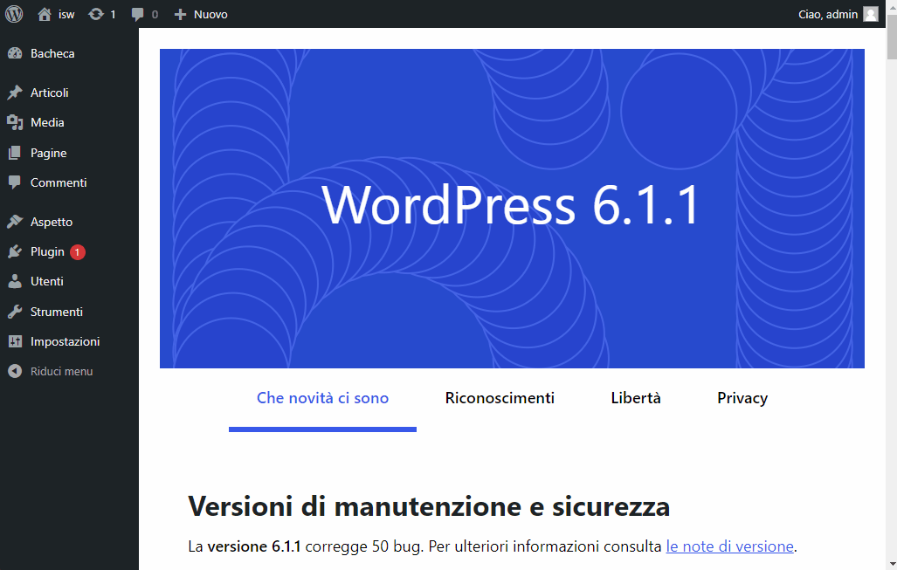
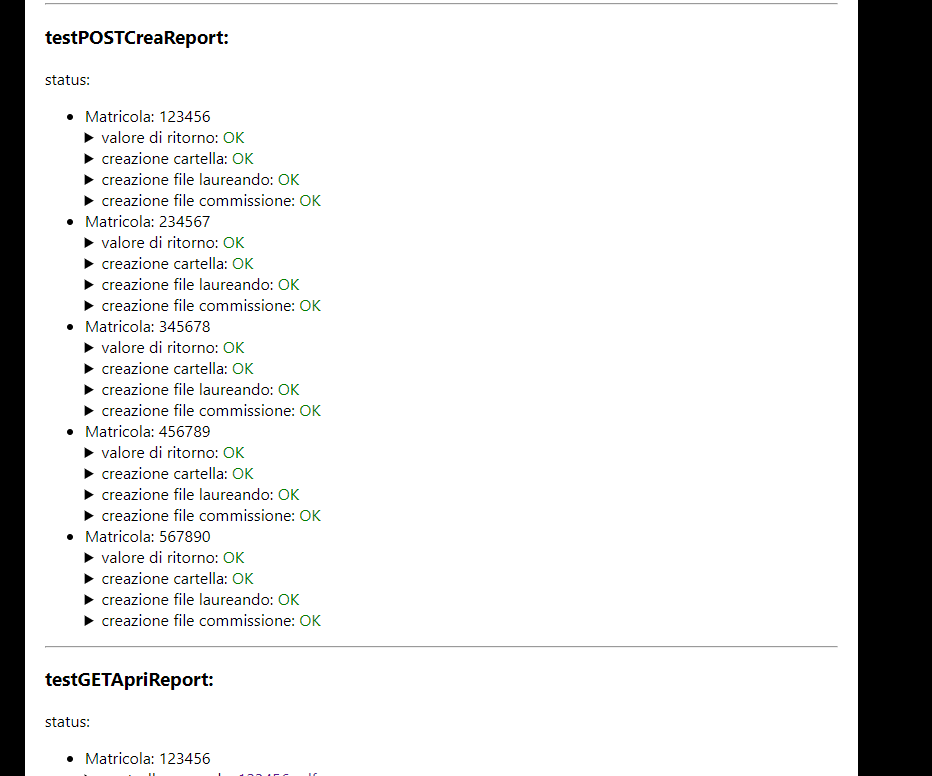

<style>
html {
	background-color: #333333;
}

body {
	max-width: 21cm;
	margin: 15px auto;
	background-color: white;
}
</style>

# Documentazione
## Installazione

Posizionare questa cartella nella cartella `themes` di WordPress. Per usare il tema è necessario creare prima una pagina (Home > Pagine > Aggiungi pagina) e successivamente selezionare il template `laureandosi` per la pagina appena creata.



## Configurazione

La struttura interna di Laureandosi è disposta in questo modo:
```
 ├─ laureandosi.php (file principale)
 ├─ src (cartella contenente i file sorgenti)
 │   ├─ class (cartella contenente le classi PHP)
 │   ├─ lib (cartella contenente le librerie PHP)
 │   ├─ test (cartella contenente le classi di test PHP)
 │   └─ res (cartella contenente le risorse)
 │       ├─ page
 │       │   └─ home (cartella che contiene la pagina principale)
 │       └─ config (cartella che contiene i file di configurazione)
 │ 		     ├─ corsi_di_laurea.json (file di configurazione dei corsi di laurea)
 │ 		     ├─ esami_informatici.json (file che contiene l'elenco degli esami informatici)
 │ 		     └─ filtro_esami.json (file di configurazione del filtro degli esami)
```

> <b style="color:#31708f;"> **Note** </b><br>
> I report verranno salvati nella directory principale di WordPress e **NON** in questa cartella.

### `corsi_di_laurea.json`

Il file `corsi_di_laurea.json` contiene l'elenco dei corsi di laurea, le formule, i parametri, e il messaggio da inviare per email. Un esempio del contenuto del file è il seguente:
```json
{
    "t-inf": {
        "cdl": "T. Ing. Informatica",
        "cdl-alt": "INGEGNERIA INFORMATICA (IFO-L)",
        "cdl-short": "t-inf",
        "voto-laurea": "M*3+18+T+C",
        "tot-CFU": 177,
        "par-T": {
            "min": 0,
            "max": 0,
            "step": 0
        },
        "par-C": {
            "min": 1,
            "max": 7,
            "step": 1
        },
        "txt-email": "..."
    },
}
```
I campi sono i seguenti:
* `cdl`: nome completo del corso di laurea
* `cdl-alt`: nome completo del corso di laurea (versione alternativa)
* `cdl-short`: nome abbreviato del corso di laurea
* `voto-laurea`: formula per il calcolo del voto di laurea
* `tot-CFU`: numero totale di CFU
* `par-T`: parametro T per il calcolo del voto di laurea
* `par-C`: parametro C per il calcolo del voto di laurea
* `txt-email`: messaggio da inviare per email ai laureandi

### `esami_informatici.json`

Il file `esami_informatici.json` contiene l'elenco degli esami informatici. Un esempio del contenuto del file è il seguente:
```json
[
	"FONDAMENTI DI PROGRAMMAZIONE",
	"ALGORITMI E STRUTTURE DATI",
	"BASI DI DATI",
	"RETI LOGICHE",
	"CALCOLATORI ELETTRONICI",
	"PROGETTAZIONE WEB",
	"INGEGNERIA DEL SOFTWARE",
	"SISTEMI OPERATIVI",
	"RETI INFORMATICHE",
	"PROGETTAZIONE DI RETI INFORMATICHE",
	"PROGRAMMAZIONE AVANZATA",
	"PROGRAMMAZIONE",
	"FONDAMENTI DI INFORMATICA I",
	"FONDAMENTI DI INFORMATICA II"
]
```

### `filtro_esami.json`

Il file `filtro_esami.json` contiene le informazioni per il filtro degli esami. Un esempio del contenuto del file è il seguente:
```json
{
    "t-inf": {
		"*": {
			"esami-non-avg": [
				"PROVA DI LINGUA INGLESE (B1)",
				"PROVA DI LINGUA INGLESE",
				"PROVA DI LINGUA INGLESE B2",
				"TIROCINIO"
			],
			"esami-non-cdl": [
				"PROVA FINALE",
				"LIBERA SCELTA PER RICONOSCIMENTI",
				"TEST DI VALUTAZIONE DI INGEGNERIA"
			]
		},
		"1234": {
			"esami-non-avg": [
				"TEST3"
			],
			"esami-non-cdl": [
				"TEST4"
			]
		}
	}
}
```
I campi sono i seguenti:
* `esami-non-avg`: esami che non vanno considerati per il calcolo del voto medio
* `esami-non-cdl`: esami che non vanno mostrati nel report

> <b style="color:#31708f;"> **Note** </b><br> Come chiave del corso di laurea è utilizzato il nome abbreviato del corso di laurea. Se si vuole applicare le stesse regole a tutti i laureandi è possibile utilizzare il carattere `*`. Se si vuole applicare delle regole specifiche ad un singolo laureando è possibile utilizzare il numero di matricola del laureando (come in esempio il `1234`).

<hr>

## Utilizzo

Per utilizzare il programma è necessario accedere alla pagina creata in fase di [installazione](#installazione). 

Il programma permette di eseguire 3 operazioni:
* **Crea Report**: Permette di creare i report dei laureandi e per la commissione di laurea.
* **Apri Report**: Permette di aprire il per la commissione di laurea per la revisione.
* **Invia Report**: Permette di inviare per email i report ai laureandi.

In caso di dubbi è possibile passare il mouse sopra i vari pulsanti per avere una descrizione dell'operazione.

> <b style="color:#31708f;"> **Note** </b><br> È possibile riprendere l'utilizzo del programma da qualsiasi punto anche dopo averlo chiuso. Per esempio se si è già creato i report ma non si è ancora aperto il report per la commissione è possibile aprirlo senza dover ricreare tutto.

> <b style="color:#31708f;"> **Note** </b><br> È stato implementato un meccanismo di registrazione dell'invio email che previene l'invio di email multiple allo stesso laureando. Per ripristinare il meccanismo è necessario cancellare il file `stato_invio.json` situato nella rispettiva cartella dei report.

> <b style="color:#8a6d3b;"> **Warning** </b><br> Se attivo lo sflag `Test` varrà ignorato il filtro esami e il controllo corso di laurea.

### Op. Crea Report

Per questa operazione è necessario aver selezionato il corso di laurea (dal menù a tendina), la data di laurea (dal calendario) e scritto i numeri di marticola dei laureandi (uno per riga) nell'apposito campo di testo. Successivamente è necessario cliccare sul pulsante `Crea Report` per creare i report.\
Se la creazione dei report è andata a buon fine verrà visualizzato un messaggio di conferma del tipo ` 3 report creati con successo`.\
Altrimenti verrà visualizzato un messaggio di errore del tipo `Errore: ...` con il relativo messaggio di errore.

### Op. Apri Report

Per questa operazione è necessario aver selezionato il corso di laurea (dal menù a tendina), la data di laurea (dal calendario) e aver precedentemente completato l'operazione [Crea Report](#op-crea-report). Successivamente è necessario cliccare sul pulsante `Apri Report` per aprire il report per la commissione di laurea.\
Se tutto è corretto verrà aperta una nuova scheda del browser con il report per la commissione di laurea.\
Altrimenti verrà visualizzato un messaggio di errore del tipo `Errore: ...` con il relativo messaggio di errore.

### Op. Invia Report

Per questa operazione è necessario aver selezionato il corso di laurea (dal menù a tendina), la data di laurea (dal calendario), scritto i numeri di marticola dei laureandi (uno per riga) nell'apposito campo di testo e aver precedentemente completato l'operazione [Crea Report](#op-crea-report). Successivamente è necessario cliccare sul pulsante `Invia Report` per inviare i report ai laureandi.\
Se l'invio dei report procede correttamente verranno visualizzati i messaggi di conferma del tipo `Report inviato al laureando 65468. 3 report rimanenti. ...` per ogni laureando ogni 10 secondi.\
Altrimenti verrà visualizzato un messaggio di errore del tipo `Errore: ...` con il relativo messaggio di errore.

> <b style="color:#8a6d3b;"> **Warning** </b><br>
> Verranno inviate le email **SOLO** ai laureandi inseriti nel box 'Matricole'. 

<hr>

## Test

Per testare il programma è possibile accedere alla pagina test aggiungendo `?test` alla fine dell'url della pagina.\
Per esempio se la pagina è raggiungibile all'indirizzo `https://www.example.com/laureandosi/` è possibile accedere alla pagina test all'indirizzo `https://www.example.com/laureandosi/?test`.

In questa pagina è possibile testare le funzionalità del programma. I test verranno eseguiti automaticamente al caricamento della pagina.\
Se tutti i test sono andati a buon fine verrà visualizzato un OK verde affianco ad ogni test, altrimenti verrà visualizzato il messaggio di errore. È possibile espandere il contenuto di ogni test cliccando sul pulsante `>` affianco al test per visualizzarne i dettagli.

